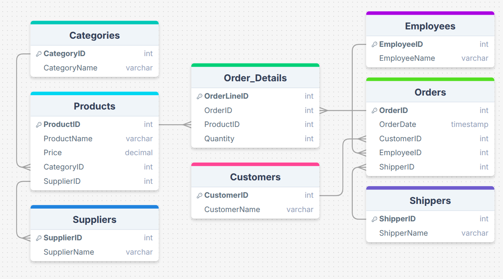

# ERD-Kiwilytics-Project
ERD for a sample relational database including Orders, Customers, Products, and Suppliers.

# 🗄️ Relational Database Schema — Kiwilytics Project

This repository contains an **Entity-Relationship Diagram (ERD)** representing a sample relational database used in the Kiwilytics data engineering course.  
It shows how data is structured and connected across multiple entities — a key concept in data engineering and data modeling.

---

## 📊 Tables Overview

| Table | Primary Key | Foreign Keys |
|-------|--------------|--------------|
| **Categories** | CategoryID | — |
| **Customers** | CustomerID | — |
| **Employees** | EmployeeID | — |
| **Orders** | OrderID | CustomerID → Customers.CustomerID EmployeeID → Employees.EmployeeID ShipperID → Shippers.ShipperID |
| **Order_Details** | OrderLineID | OrderID → Orders.OrderID ProductID → Products.ProductID |
| **Products** | ProductID | CategoryID → Categories.CategoryID SupplierID → Suppliers.SupplierID |
| **Shippers** | ShipperID | — |
| **Suppliers** | SupplierID | — |

---

## 🗺️ ERD Diagram

Below is the relational schema visualizing how the tables connect:

---

## 💡 Description

This schema models a small **retail or e-commerce database** with realistic relationships:
- **Customers** place **Orders**.
- Each **Order** is managed by an **Employee** and shipped through a **Shipper**.
- **Order_Details** link **Orders** to the **Products** purchased.
- **Products** belong to **Categories** and are supplied by **Suppliers**.

This logical structure supports essential operations such as:
- Tracking sales, products, and customers  
- Managing suppliers and inventory  
- Monitoring employee performance  
- Generating analytical insights for business intelligence

---

## 🧰 Tools Used
- **drawSQL.io** — to create the ERD  
- **GitHub** — for version control and documentation  

---

## 📘 About
Created as part of the **Kiwilytics Data Engineering Course**, focusing on mastering:
- Data modeling  
- Relational database design  
- Understanding key database relationships (1:1, 1:N, N:M)
